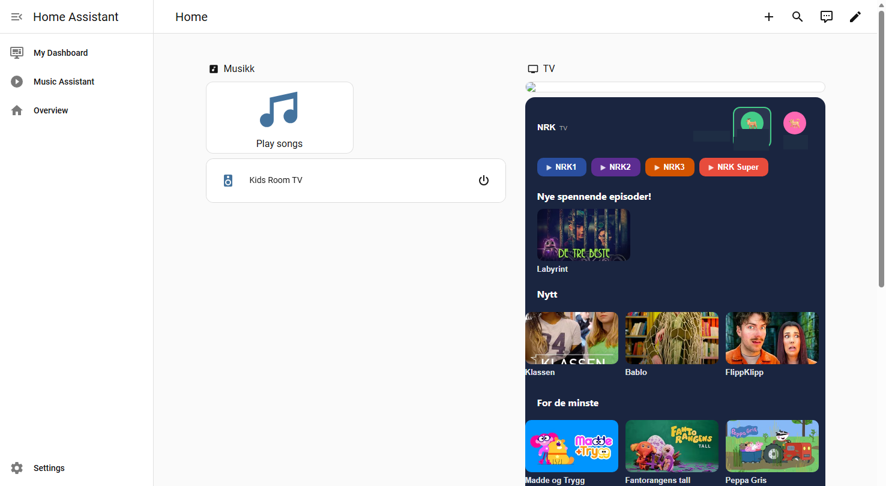

# NRK TV Card for Home Assistant

A custom Lovelace card that replicates the NRK TV browsing experience from [tv.nrk.no](https://tv.nrk.no) directly in your Home Assistant dashboard.



## Features

- **Profile switching** — Switch between adults and children profiles with custom avatars
- **Live channel buttons** — Quick access to NRK1, NRK2, NRK3, and NRK Super
- **Browsable children's content** — Grid layout with thumbnails for kids' programming
- **Series overlay** — Navigate seasons and episodes within a series
- **Responsive design** — Works on desktop and mobile
- **Visual config editor** — Configure the card directly from the Lovelace UI

## Requirements

This card requires the **ha-nrk-tv** integration for the WebSocket API backend:

👉 [github.com/filipferris/ha-nrk-tv](https://github.com/filipferris/ha-nrk-tv)

Install the integration first, then add this card for the frontend UI.

## Installation

### HACS (recommended)

1. Open HACS in Home Assistant
2. Go to **Frontend** → **⋮** → **Custom repositories**
3. Add `https://github.com/filipferris/ha-nrk-tv-card` as a **Lovelace** repository
4. Search for "NRK TV Card" and install it
5. Restart Home Assistant

### Manual

1. Download `dist/nrk-tv-card.js` from this repository
2. Copy it to your `config/www/` directory
3. Add the resource in **Settings → Dashboards → ⋮ → Resources**:
   - URL: `/local/nrk-tv-card.js`
   - Type: **JavaScript Module**
4. Restart Home Assistant

## Configuration

Add the card to a dashboard view:

```yaml
type: custom:nrk-tv-card
media_player: media_player.living_room_tv
profiles:
  - name: Parent
    content_group: adults
    color: "#4a90d9"
  - name: Child 1
    content_group: children
    avatar: "🐕"
    color: "#ff69b4"
  - name: Child 2
    content_group: children
    avatar: "🦌"
    color: "#44cc88"
```

### Options

| Option | Type | Required | Description |
|--------|------|----------|-------------|
| `media_player` | string | **Yes** | Entity ID of the media player to control |
| `profiles` | list | No | Array of user profiles |
| `profiles[].name` | string | No | Display name for the profile |
| `profiles[].content_group` | string | No | `adults` or `children` — determines available content |
| `profiles[].avatar` | string | No | Emoji or icon for the profile button |
| `profiles[].color` | string | No | Accent color for the profile (hex) |

## How It Works

The card communicates with the **ha-nrk-tv** integration via Home Assistant WebSocket commands:

- `nrk_tv/browse` — Fetches content listings and categories
- `nrk_tv/series` — Retrieves series metadata with seasons
- `nrk_tv/episodes` — Loads episodes for a given season

Playback is initiated by resolving streams through `media-source://nrk_tv/` URIs, which the integration translates into playable media URLs for your media player.

## ⚠️ Geo-restriction

NRK content is geo-blocked to Norway. You must be located in Norway (or use a Norwegian IP) to stream content.

## License

[MIT](LICENSE) © 2026 Filip Ferris
